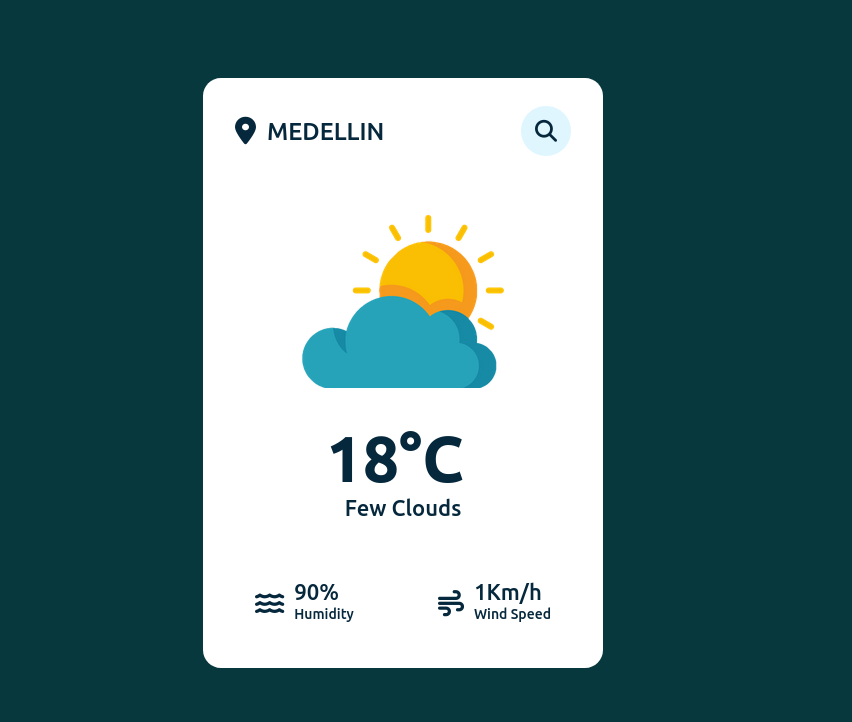

# weather-app-js



**API Deploy:**

### [https://johndev85.github.io/weather-app-js/](https://johndev85.github.io/weather-app-js/)

---

## 🎯 Objective

- Create a basic design to consume an Weather API.

---

## 🚀 Getting started

If you want to run the site locally, you can:

1. Clone the project.

```bash
https://github.com/Johndev85/weather-app-js.git
```

2. Go to project's folder

```bash
cd weather-app-js
```

3. Open index.html

---

## Api - Descripcion

-API public The Lorem Ipsum for photos.

- [https://openweathermap.org/api](https://openweathermap.org/api)

---

## 🛠 Deployment

- Deploy: Github Pages

---

## 🧾 License

- The MIT License (MIT)

---

## ➕ Contributing

- If you want to contribute with this project, just make a Pull Request explaining the improving ✨.

---

## 💻 Technologies:

- HTML5
- CSS3
- JavaScript

---
